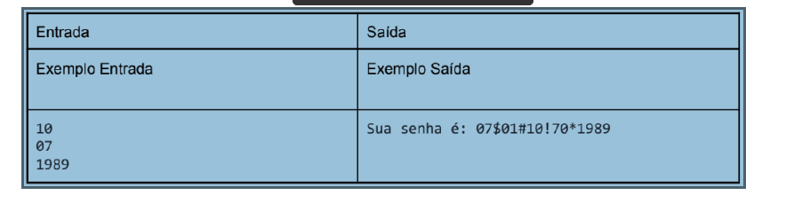

1. Por conta da pandemia, o CEF (Curso Estudante Feliz) adotou o Google Classroom como ferramenta para auxiliar o ensino remoto. Para acessá-lo, os estudantes precisam logar com e-mail institucional e senha. A senha inicial, enviada pela Agenda Digital, é gerada automaticamente a partir da data de nascimento do aluno, do seguinte modo:
mm + ‘$’ + dd(invertido) + ‘#’ + dd + ‘!’ + mm(invertido) + ‘*’ + aaaa
Escreva um programa que leia o dia, mês e ano de nascimento de um estudante e informe a senha de acordo com a formatação acima.

2. Faça uma função que receba uma lista de números e dois valores (limite inferior e limite superior). A função deverá retornar uma lista cujo os elementos são maiores ou iguais ao limite inferior e menores ou iguais ao limite superior. No programa principal, informe 10 números inteiros, armazenando-os numa lista. Informe também o limite inferior e o limite superior. Teste a função implementada e exiba o resultado.

3. Desenvolva uma função que permita receber uma variável inteira X inúmeras vezes (deve parar quando o valor digitado for igual a zero). Como retorno da função, para cada valor lido deverá ser imprimido a sequência de 1 até X (o número digitado), com um espaço entre cada número e seu sucessor.

4. Faça um programa que receba um valor em horas e dê duas opções ao usuário, converter em minutos ou em segundos. A partir da escolha do usuário, o programa deverá chamar a função específica de conversão. A função para converter horas em minutos deverá receber como parâmetro a hora e retornar o valor em minutos. A função para converter horas em segundos deverá receber como parâmetro a hora e retornar o valor em segundos. No programa principal imprima o valor retornado pela função.

Faça uma função que retorne o reverso de um número inteiro informado pelo usuário.
Por exemplo: 127 -> 721.